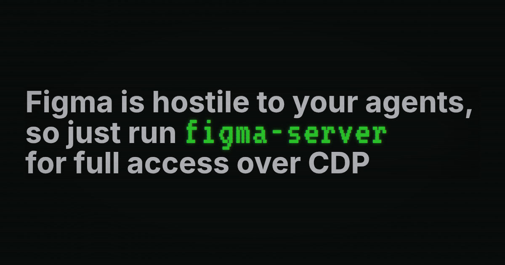

Figma wants to choose which agents can use your files through its MCP server. They would also like you to use [*their* agent](https://www.figma.com/ai/). This is clearly an untenable position for them. The inevitable conclusion is that people have their own agents. This could be a personal agent, a coding agent, an enterprise agent, or whatever. We're not going to have 1000 agents for 1000 different apps and services. We're going to have one agent and give it tools!

Figma is a tool. And I will happily pay for it as I have for years. But I'm not going to use the Figma agent.

## Evidence of Hostility

- **Figma's own policy:** “Only clients listed in the Figma MCP Catalog can connect to the Figma MCP Server.” Developers of other clients are directed to a waitlist. [Official documentation](https://developers.figma.com/docs/figma-mcp-server/)

- **HN discussion:** [“Figma restricts MCP access to whitelisted clients, excluding Pi”](https://news.ycombinator.com/item?id=49922729). A [firsthand comment](https://news.ycombinator.com/item?id=49923207) describes Copilot Desktop connection failures because Copilot CLI was approved but Desktop wasn't. The commenter says it eventually worked.

- **X exchange with Dylan Field:** The discussion includes [Figma employee Gayani’s supported-client reply](https://x.com/GayaniFigma/status/2105295629941350454), [MCP co-creator @dsp_’s criticism](https://x.com/dsp_/status/2105316536852320279), and [Figma CEO Dylan Field’s response](https://x.com/zoink/status/2105369960008855914).

- **GitHub rejection report:** [pi-mcp-adapter issue #49](https://github.com/nicobailon/pi-mcp-adapter/issues/49) includes an OAuth registration failure returning `403 Forbidden` and requests catalog approval. The [maintainer’s closing comment](https://github.com/nicobailon/pi-mcp-adapter/issues/49#issuecomment-5076558935) treats this as requiring external Figma approval.

- **Custom-agent friction on Figma's forum:** [A backend developer reports authenticated requests producing no canvas changes](https://forum.figma.com/ask-the-community-7/can-figma-mcp-be-used-for-programmatic-design-generation-seems-like-read-only-only-57148). The accepted answer explains the supported-client workflow and demonstrates writes through Claude Code.

- **Quota frustration on Reddit:** [“How to limit MCP tool calls?”](https://www.reddit.com/r/FigmaDesign/comments/1sbfwkl/how_to_limit_mcp_tool_calls/) describes exhausting the allowance during basic design experimentation. [Current official limits](https://developers.figma.com/docs/figma-mcp-server/rate-limits-access/) allow View/Collab seats six read calls per month on paid plans, or 20 on Starter. Some write tools are exempt.

Figma supports multiple third-party clients, and approved workflows can write with a Full seat. [Current write documentation](https://developers.figma.com/docs/figma-mcp-server/write-to-canvas/). The approval gate is the objection here.

## So what do we do?

Well, Figma is just a web app. So let's open it in Chromium, sign in, and let our agents drive the browser through Chrome DevTools Protocol (CDP). Your agent can click, type, take screenshots, run arbitrary JavaScript and open multiple tabs to work on different files.

We bundled that workflow as `figma-server`. Run it, sign in once, and connect your agent through MCP or the HTTP API. The browser runs headlessly once you're signed in. Your login stays in the dedicated profile until Figma asks you to sign in again.

So let's get started!

## Install

You need **Node.js 22.16.0 or newer, npm, and a graphical desktop for sign-in**.

```sh
npm i -g https://github.com/ctxrs/figma-server/releases/download/v0.2.0/ctxrs-figma-server-0.2.0.tgz
```

This installs the released [v0.2.0 prerelease](https://github.com/ctxrs/figma-server/releases/tag/v0.2.0).

## Log in and connect your agent

First, initialize the dedicated profile and install Chromium:

```sh
figma-server init
figma-server browser-install
```

**Using Google or enterprise SSO?** [Configure the exact provider origins](docs/operations.md#google-and-enterprise-sso) before logging in.

Then, in the same terminal:

```sh
figma-server login
figma-server run
```

Sign in in the browser window, then press Enter in the terminal. Keep `run` open while your agents work; Ctrl+C stops it. Login can happen before the daemon starts.

Add this to your agent's MCP configuration:

```json
{
  "mcpServers": {
    "figma-local": {
      "command": "figma-server",
      "args": ["mcp"]
    }
  }
}
```

Keep the server running while your agent connects. The MCP launcher handles authentication automatically; you don't have to paste tokens. If your agent cannot find `figma-server`, use its absolute path; see [MCP launcher setup](docs/operations.md#mcp-launcher-setup).

Give your agent a plain Design file URL your account can access:

> Open this Figma file, inspect the visible layers and controls, and take a screenshot. Release the file when you're done.

For a first edit, use a disposable file:

> Create a Frame in this test file, set it to 600 × 400, and read both values back. Take a screenshot and release the file. If you can't verify a step, tell me what you observed.

Building your own agent? Use the [JSON HTTP API](docs/agent-tools.md#json-http-api). The [agent tools guide](docs/agent-tools.md) has the arguments and examples.

## FAQ

### Can I use Figma at the same time as my agent?

Yes. Keep using Figma in your normal browser while your agent uses the dedicated browser. Figma's collaboration handles the shared file, but don't edit the same elements simultaneously.

### Do I have to sign in every time?

No. The dedicated profile keeps your login between runs until Figma asks you to sign in again. Logging in again invalidates that account's active agent leases, so finish their work first.

### Do I need a Figma API key?

No. You sign in to the web app with your normal Figma account. Your account still needs permission to view or edit the file.

### Do I need Chrome installed?

`figma-server browser-install` installs full Chromium. You can instead select an existing Chrome or Chromium executable with `figma-server init --browser /absolute/path/to/chromium`; see [browser setup](docs/operations.md#browser-setup).

### Which agents can use this?

Any agent that can connect to an MCP stdio server or call the JSON HTTP API. Use the agent and model provider you already have. Give access only to agents you trust: they have browser authority, and results go to the agent and any model provider it uses.

### Can several agents work at once?

Yes: up to 32 client sessions and eight managed tabs. Managed operations allow one writer per file at a time. Raw JavaScript and CDP can bypass those locks and affect other agents' tabs; see [network access and shared browser authority](docs/operations.md#network-access).

### Can my agent run arbitrary JavaScript and CDP commands?

Yes. `figma.evaluate` runs arbitrary page JavaScript; `figma.cdp` sends arbitrary protocol commands, with persistent connections and event polling. These tools do not supply a native Figma node API. See [JavaScript, CDP and events](docs/agent-tools.md#javascript-cdp-and-events).

### Can I run it on another machine?

Yes, with Chromium's dependencies and a graphical display you can reach for login. After login, the daemon uses a headless browser. Use an [SSH tunnel](docs/operations.md#network-access) for remote access and keep the daemon on loopback. The tunnel itself does not provide the login display.

### What if something breaks?

Run `figma-server doctor` and check [Operations](docs/operations.md). Figma UI changes can break browser automation. An input being dispatched does not prove an edit was saved; the [tool guide](docs/agent-tools.md) and [qualification guide](docs/TESTING.md) explain the limits and what has actually been tested.
